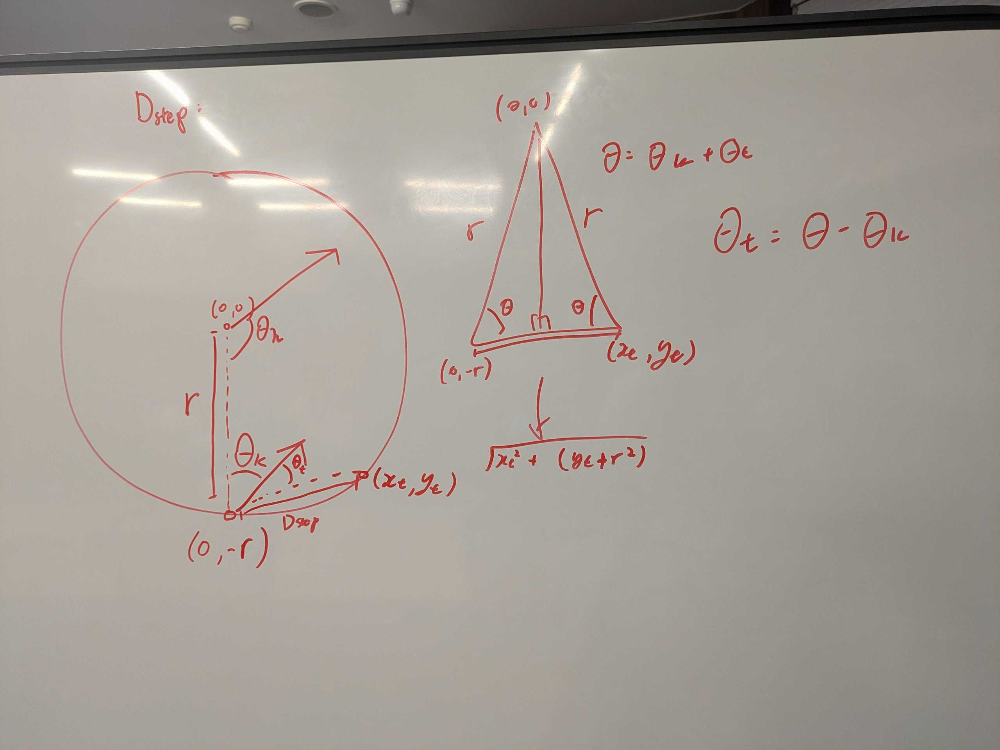
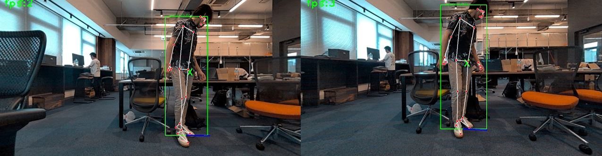
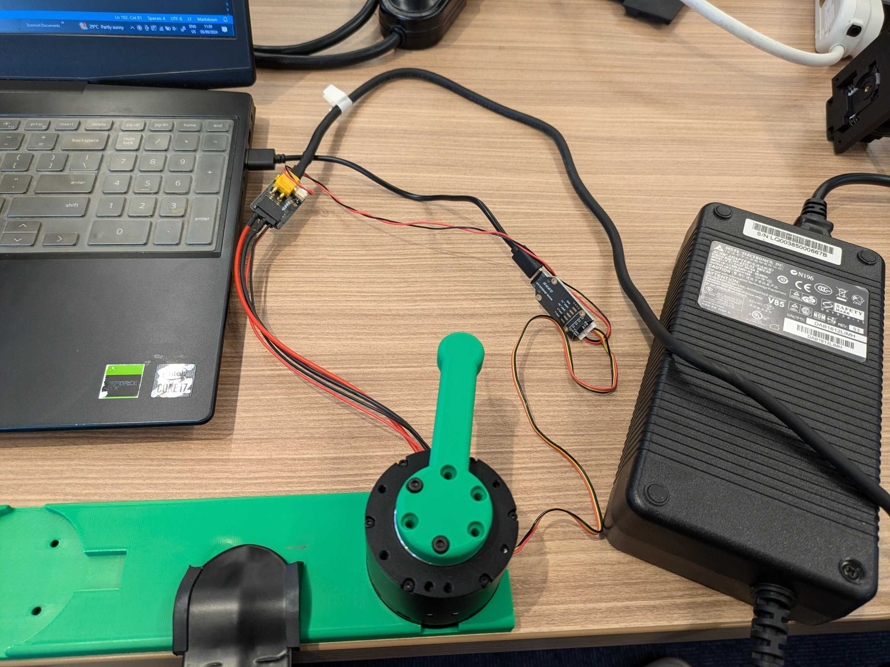

# kachaka-learn

Learning kachaka-api
think-pad pass:1234

# Execute
1. activate venv
2. Get Damiao API `wget --no-check-certificate --content-disposition --directory-prefix=motor https://raw.githubusercontent.com/cmjang/DM_Control_Python/main/DM_CAN.py`
3. `pip install -r requirements.txt; pip install -r ./MEBOW/requirements.txt`

# Folder
- `asset`
  - data
- `cocoapi`
- `demo`
  - test files for learning to use kachakaAPI
- `dev`
  - files produced during the stage of development
- `lib`
  - custom libraries. Includes libs from other repos
- `MEBOW`
  - cloned repo for HOE
- `openpose`
  - cloned repo for HOE (Pose detection)
- `stalk`
  - contains files made during the make of main program
- `motor`
  - contains files used for learning to use the DAMIAO motor

# Debug / Profile
`scalene --cpu --memory --cli .\stalk\main.py`

# TODO
- [x] learn kachaka
- [x] teleop with live cam and lidar display
  - cam is laggy even tho fps is high
- [x] make kachaka move towards a person it sees
- [x] add face detection pipeline and take a snap of the front side w face in frame
- [x] asynchronous control of multiple robots
- [x] navigation system for multiple robots
  - set points to go to, or be able to share coordinates between both robots
- [x] camera / video setup which displays more continuosly
- [x] smooth switching between navigate and human_detection
- [ ] make kachaka move to the front side of the person via HOE or pose detection
  - [x] MP pose landmark > orientation for *full body*
  - [ ] circle around target in fixed distance till face can be seen
  - [ ] adjust distance to target s.t. face can be seen
- [ ] move kachaka and external devices with mounted laptop
  - [x] kachaka
  - [ ] robot arm
    - [x] DAMIAO motor
  - [ ] camera
    - [ ] RealSense
    - [x] eMeet c960 webcams
      - [ ] allow full resolution (currently stuck on cv2 default 640x480. able to go to 1920x1080 using other codes)
- [ ] Test model speeds
  - [ ] human detection
  - [ ] face detection
  - [ ] HOE

---

- $\theta_e = 180 - 2*\theta$
- $x_e = r\cdot cos(\theta_e)$
- $y_e = r\cdot sin(\theta_e)$
- $\frac{\sqrt{x_t^2+(y_t+r)^2}}{\theta_e} = \frac{r}{\theta}$
  - $\theta^2x_t^2+\theta^2(y_t+r)^2=r^2\theta_e^2$
  - $\theta^2r^2cos^2(\theta_e)+\theta^2r^2sin^2(\theta_e)+2r^2sin(\theta_e)+r^2-r^2\theta_e^2=0$
  - $\theta_e^2-360\theta_e-180^2+8sin(\theta_e)+4-4\theta_e^2=0$
  - $$

# Concurrency

[resource](https://superfastpython.com/python-concurrency-choose-api/#Problem_of_Pythons_Concurrency_APIs)

1. Choosing a module
   1. Coroutine-based using `asyncio`
   2. Thread-based using `threading`
   3. Process-based using `multiprocessing`
2. pool-based (e.g. process Pool) or class-based (e.g. Process class)?
   1. If using pool-based, Pool class or PoolExecutor class?

# Kachaka
- [specs](https://kachaka.life/technology/)

## Command List
[synchronous API calls](https://github.com/pf-robotics/kachaka-api/blob/main/docs/kachaka_api_client.ipynb)
[asynchronous API calls](https://github.com/pf-robotics/kachaka-api/blob/main/docs/kachaka_api_client_async.ipynb)

# Human-body orientation estimation

- **Monocular Estimation of Body Orientation in the Wild**
  - [repo](https://github.com/ChenyanWu/MEBOW)
  - Works well camera captures whole body, except when facing away (angle prediction oscillates aggressively), otherwise unusable
- **Partial-Human Orientation Estimation**
  - [repo](https://github.com/zhaojieting/Part_HOE)
  - [paper](https://arxiv.org/pdf/2404.14139)
  - No pre-trained model, in contact with author
- **OpenPose**
  - [repo](https://github.com/CMU-Perceptual-Computing-Lab/openpose/)
  - [pytorch implementation repo](https://github.com/Hzzone/pytorch-openpose?tab=readme-ov-file)
  - too slow (suggested usage w gpu)
- **MP Pose**
  - [web](https://ai.google.dev/edge/mediapipe/solutions/vision/pose_landmarker/python)
  - only works with full body

# DAMIAO motor

- [repo](https://github.com/cmjang/DM_Motor_Control)
- [python repo](https://github.com/cmjang/DM_Control_Python/blob/main/DM_CAN.py)
- send-and-receive mode
- modified parameters gets reset after switching off
- max phase current for DM43 series: 10.25A. By default current limit is set to 80% of max current 
- **Drive Parameters**
  - number of pole pairs
  - under voltage: minimum voltage for motor to work
  - over voltage: upper limit of driver's working voltage
  - accel / deccel: using in non-MIT mode as limit
  - reduction ratio: affect speed and position
  - over temp: motor coil max temp
  - CAN_ID: ID of driver receiving the CAN command
  - CAN timeout: num of cycles for timeout
  - speed limit:
  - over current: percentage, max phase current
- **Motor Parameters**: automatically identified by driver
- **Control amplitude**: drive command param range settings
  - PMAX: motor reaction value or ID for motor mapping
  - VMAX: ~= PMAX
  - TMAX: ~= PMAX
  - KT_OUT: torque coefficient of motor. if motor params are accurate, set to 0
  - Gear Coefficient: gear torque transmission
- **Control Settings**
  - Control Modes: MIT, vel pos, vle
  - current bandwidth: gain conefficient default 1000
  - KP/KI: for vel and pos mode respectably 