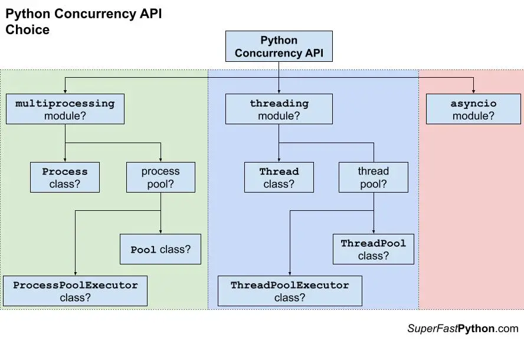
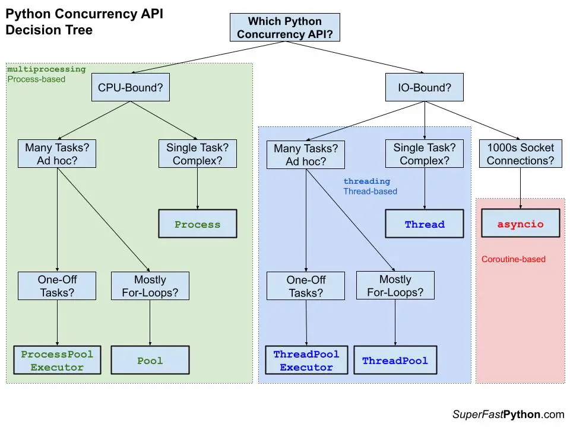

# kachaka-learn

Learning kachaka-api

# Execute
1. `venv/Source/activate`
2. `pip install -r requirements.txt; pip install -r ./MEBOW/requirements.txt`

# Debug / Profile
`scalene --cpu --memory --cli .\stalk\main.py`

# Command List

# TODO
- [x] learn kachaka
- [x] teleop with live cam and lidar display
  - cam is laggy even tho fps is high
- [x] make kachaka move towards a person it sees
- [x] add face detection pipeline and take a snap of the front side w face in frame
- [x] asynchronous control of multiple robots
- [x] navigation system for multiple robots
  - set points to go to, or be able to share coordinates between both robots
- [x] camera / video setup which displays more continuosly
- [x] smooth switching between navigate and human_detection
- [ ] make kachaka move to the front side of the person
  - [ ] voice output to get the attention of the user

# Concurrency

[resource](https://superfastpython.com/python-concurrency-choose-api/#Problem_of_Pythons_Concurrency_APIs)

1. Choosing a module
   1. Coroutine-based using `asyncio`
   2. Thread-based using `threading`
   3. Process-based using `multiprocessing`
2. pool-based (e.g. process Pool) or class-based (e.g. Process class)?
   1. If using pool-based, Pool class or PoolExecutor class?

# Human-body orientation estimation

- **Monocular Estimation of Body Orientation in the Wild**
  - [repo](https://github.com/ChenyanWu/MEBOW)
  - Works well camera captures whole body, except when facing away (angle prediction oscillates aggressively), otherwise unusable
- **Partial-Human Orientation Estimation**
  - [repo](https://github.com/zhaojieting/Part_HOE)
  - [paper](https://arxiv.org/pdf/2404.14139)
  - No pre-trained model